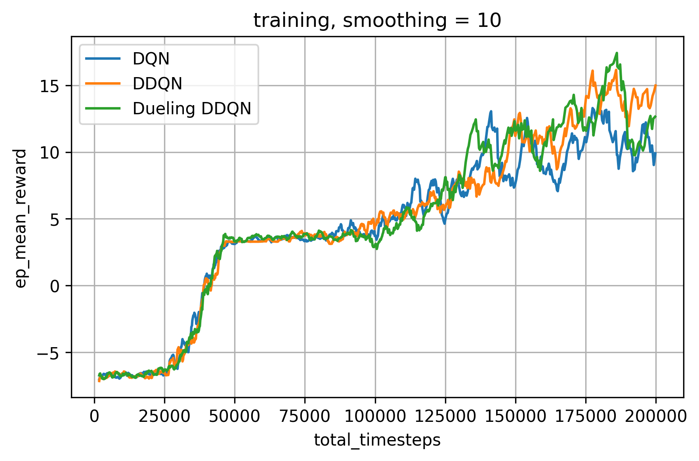
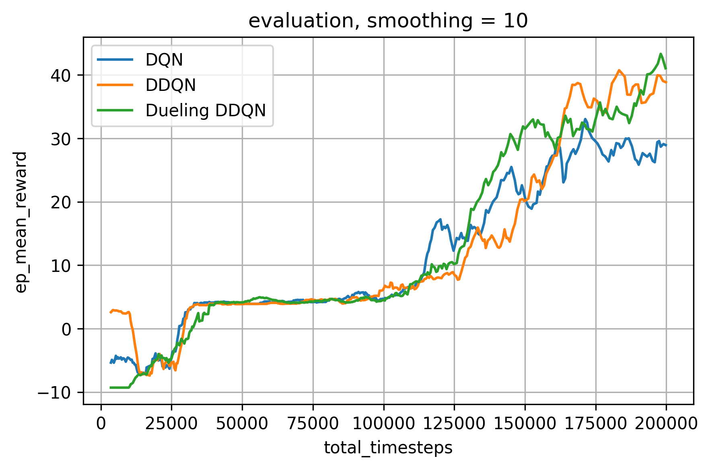

# Playing Flappy Bird with DQN


| Training history      |    Evaluation history |
|-----------------------|-----------------------|
|  |  |

### Installation

Create and activate virtual enviroment:

```
python3 -m venv .venv
source .venv/bin/activate
```

Install dependencies:
```
pip install -r requirements.txt
```

###  Running the code

Test trained model in real time:

```
python3 flappy_dqn.py --mode test --dirpath models/flappy_dueling_ddqn/ --test_fps 30
```

Training new model:
```
python3 flappy_dqn.py --mode train --hyperparams base_hyperparams.json
```

Finetuning existing model:
```
python3 flappy_dqn.py --mode train --dirpath models/flappy_dueling_ddqn/ --hyperparams tune_hyperparams.json
```

Show instructions:
```
python3 flappy_dqn.py --help
```